*Apr 2025: This is complete slop btw, and I'm half tempted to take it down. I did it to try and get a summer research bursary from uni, but going over it now... damn, it sucks.*

---

*Find code on [GitHub](https://github.com/nat-echlin/trading-public).*

Pairwise statistical arbitrage is a well-researched strategy - it can get very complex, but the core idea is simple. 

Take two assets, A and B. Over the past few years, A and B have tracked each other quite well. If A goes up, so does B. If A goes down, so does B. Then, if A goes up, but B doesn’t, we can make a gamble. We go long on B, and short on A - our gamble is that they return to tracking each other again, which they’ve done in the past. 

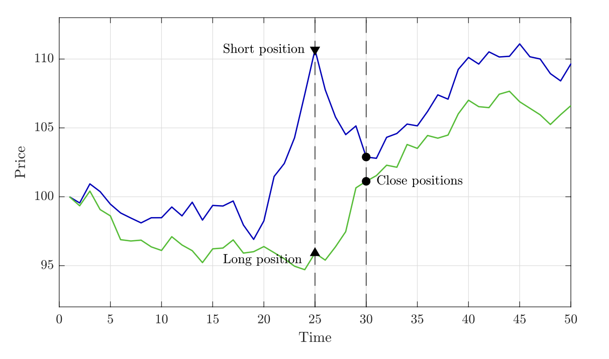

Pic taken from Šarić et al (2023).

If this gamble pays off, we make the profit from both the long on B and the short on A. The neat trick of pairs trading is that we don’t actually mind where they meet up again - even in a downturn, as long as they do indeed meet up, the profit from our short outweighs the loss in our long. 

The seminal paper on pairs trading was Gatev et al (2006), but it’s been popular in institutional funds since around the 1980s. Because it’s so well known, there’s not much gain to be made in markets like US securities - the more people using a strategy, the less effective it is. Therefore, I’ll apply the methods to the cryptocurrency market - a market which isn’t exactly known for being efficient, which should result in higher returns. 

Before we can run the strategy in practice, we need to decide which pairs to trade. 

## How do we choose pairs?

There are lots of ways - I've implemented two from Ramos-Requena (2020). 

### Cointegration

The first method we’ll use is cointegration. Cointegrated asset prices mean that while the indivudal asset prices may not be stationary, some linear combination of them is. Two assets A and B are cointegrated if there exists some $$b$$ such that $$P_{C_t}$$ is a stationary process, defined as

$$P_{C_t} = P_{A_t} - bP_{B_t} = \mu + \epsilon_t,$$

where $$\epsilon_t$$ would be a zero-mean stationary process, and $$P_{X_t}$$ is the log price of $$X_t$$. We want to log prices to diminish any large jumps which would unnecessarily throw off following calculations. We'll see this $$P_{C_t}$$ again - call it the series of the pair. 

This works intuitively - we're subtracting the linear combination of one from the other, and being left with a stationary process as a result.

In practice - we take the list of assets, and for each individual pair, we find the cointegration coefficient $$b$$ and the constant mean $$\mu$$ via ordinary least squares regression (straightforward - we want to find those two parameters such that the difference between the log prices of the asset is minimised). Then, we subtract $$\mu$$ from the calculated $$P_{C_t}$$ to get $$\epsilon_t$$, and use the Augmented Dickey-Fuller test to check stationarity. From that, we get a p-value. We interpret this p-value $$p$$ as from the hypothesis test - “if the residuals were indeed non-stationary, there is only a $$p$$ chance of observing data as extreme as this.” Hence, the lower the ADF p-value of the series, the better candidate that pair is for pairs trading. 

I used a year of perpetual futures data for pair discovery. One of the best pairs found was COMP and SAND. I’ve never heard of them before but the nice side of this strategy - it doesn’t really matter. 

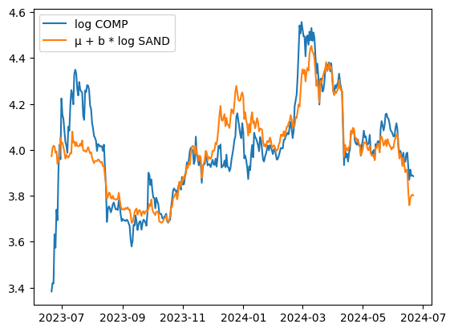

This shows how well it tracks - extremely well. For exercise, we can plot the prices without logging as well.

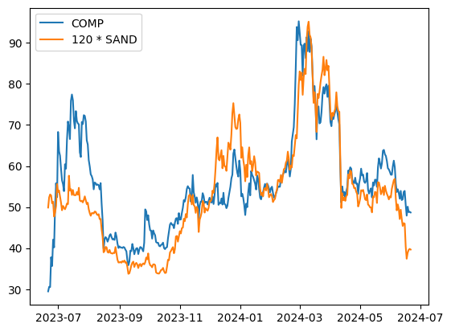

Now, if we look into the 6 months after that period, the trend continues. (back to logged prices now)

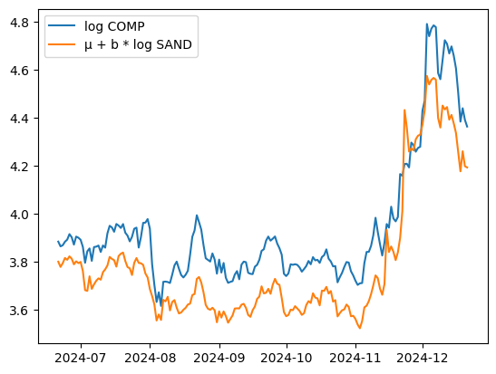

Basic visual analysis would suggest that the coefficients have changed slightly, but that’s expected. 

#### Cointegration Results

I’ll jump straight to the result of a pure cointegration pairs trading backtest. This is a return curve, with the pnl % on the Y axis.

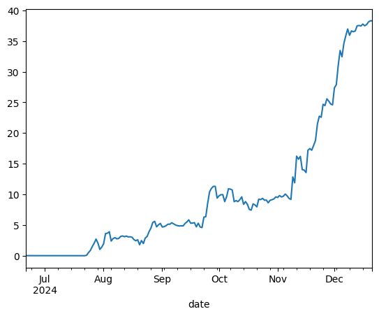

Not bad - 40% returns in a trading period of around 5 months. *Note the significant returns during the back third of the execution period. I'll discuss that later.*

The execution plan for a strategy like this is simple - for every pair of assets A and B, track the rolling mean $$\mu_t$$ over the last 30 days, and the sample standard deviation $$\sigma_t$$ over that period too. If the residual at time $$t$$, $$ \epsilon_t > \mu_t + \sigma_t$$, we sell the pair, going short on asset A and long on B. If $$\epsilon_t < \mu_t - \sigma_t$$, we buy the pair - long A, short B. For both scenarios, we’d close the position when the residual returns to the mean. 

Speaking more intuitively - if the spread between a pair of assets is surprisingly large, bet on it getting smaller. If the spread is surprisingly small, bet on it getting bigger.

This gives rise to several hyperparameters - how many pairs should we use? How many standard deviations away from the mean should we enter at? When should we close, at the mean, or when we decide we’re ‘close enough’? 

One simple way of finding those hyperparameters is with a simple grid search. 

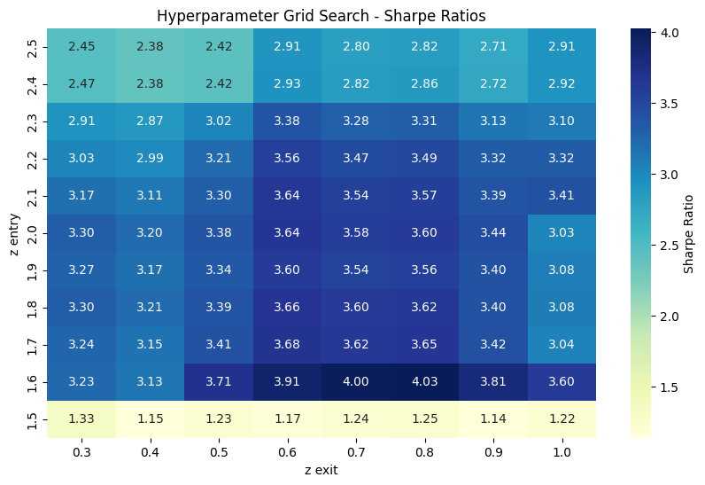

The metric used here is the Sharpe Ratio - essentially, how much profit can we expect to get in excess of the risk-free rate (think, US treasury yields), for every unit of extra risk we’re taking on. So a higher Sharpe means a better strategy, whether that's because it's less risky or gets a higher return. <a href="#note1" id="note1ref">1</a>

Unfortunately, I’ve cheated by saying it would’ve got 40% returns. That’s the square above with the deep blue 4.03 Sharpe - the parameters yielding that are for 5 pairs of unique assets, entering at 1.6 standard deviations from the mean and closing at 0.8 from the mean. It's impossible to get the perfect hyperparameters for a future period, there's too many unknowns. If I had run the strategy for the last 6 months, it would be more reasonable to expect perhaps 20-25% returns. For the rest of this project though, I'm going to keep cheating - I don't have enough data to have separate periods for formation, then hyperparameter tuning, then execution.

<a id="note1" href="#note1ref">1</a>: Sharpe isn't the only metric you should care about, but it's good enough for now - this is far from a rigorous project.

#### Generalised Hurst Exponent

The Hurst Exponent (HE) was developed by a hydrologist working on dams along the river Nile, who wanted to model the variability of the river's annual flow, so he could better find the long-term storage requirements for reservoirs. Naturally, it didn’t take long for people to find a way to apply it to financial markets.

The HE measures the persistence of a time series, a measure of the long-term memory. In a highly persistent time series, deviations from the mean in one direction tend to persist over time, rather than cancel out as expected in random processes. Finding a HE $$>0.5$$ indicates a persistent time series, whereas below $$0.5$$ indicates an anti-persistent time series. We want the series to be anti-persistent for pairs trading, so we look for the pairs with the smallest HE. 

To calculate the HE of a series, we'll use the Generalised Hurst Exponent, which is defined from the scaling behaviour of the statistic $$K_q(\tau)$$ given by the power law $$K_q(\tau) \propto \tau^{H(q)}$$, where we define $$K_q(\tau)$$ as

$$K_q(\tau) = \frac{\langle |X_{t+\tau} - X_t| \rangle}{\langle |X_t|^q \rangle}.$$

The two hyperparameters here are $$q$$ (to examine multifractal properties) and $$\tau$$ (which decides the lag at which we measure the scaling relationship). Since we only are focusing on linear aspects, we choose $$q=1$$, and as is fairly standard we choose $$\tau_{min}=1$$ and $$\tau_{max}=T/4$$, for a time series of length $$T$$.

This is fairly easy to compute. Since it's a power law relationship, we can express it as

$$\log K_q\left(\tau \right) = H_q \cdot\log\left(\tau\right) + C$$

For each pair, we find $$K_q$$ for all $$\tau \in [\tau_{min}, \tau_{max}]$$, then do a log log plot - the gradient will be $$H_q$$ which we can find with a simple OLS linear regression.

#### HE Results

The best result: 

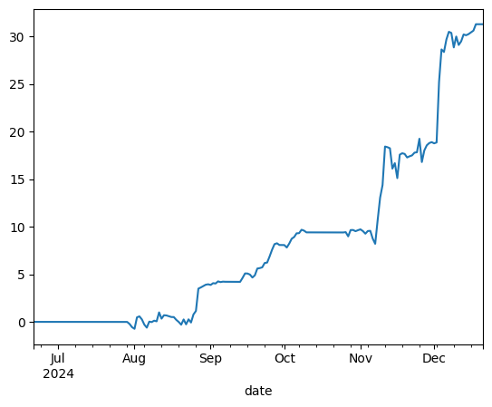

This is obviously still incredible results, with a 30% return over that 5 month period. 

Unfortunately, the hyperparameter heat map is a bit weaker than the cointegration one. 

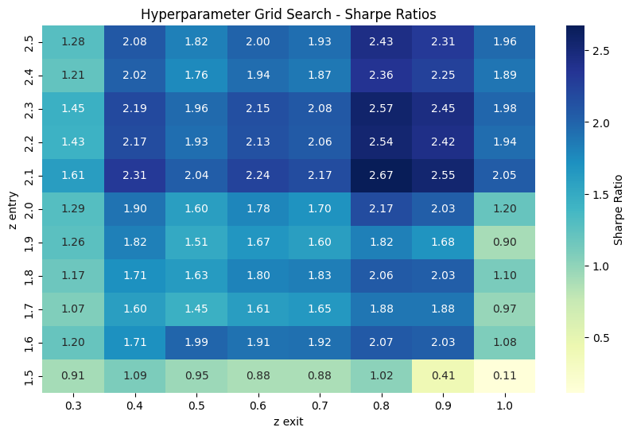

#### Comparing the two approaches

The HE is useful for learning more about the long term memory of the series, whereas cointegration just looks for stationary of the residuals. It's a good choice when there's a clear fundamental relationship, for example when looking for pairs in a group of stocks in the same industry. But it assumes a linear relationship between the pairs (i.e., the $$P_{A_t} - bP_{B_t}$$ form), whereas the HE makes no assumptions about the underlying relationship between the assets. It's also more robust to noise in the data. 

So why the HE performs worse here, I'm not too sure. This is also a good point to say that 6 months of backtest data is almost worthless. It's an interesting project, but you'd want at least 2 or 3 years to be confident in conclusions. 

## Weighting the pair

So far, we've allocated half of the trade size to a long position on one asset and half to a short position on the other asset in the pair. However, this may not be optimal according to Ramos-Requena (2020), which gives us several ways we can find the weight. I've looked into one of the best (according to that paper) which is the cointegration weight - the $$b$$ variable that we found earlier. 

In practice - let $$T$$ be the total notional amount we want to allocate to the pair as a whole, then on each trade we would allocate:

$$\frac{T}{1+b} \text{ to A, and } \frac{bT}{1+b} \text{ to B.}$$

Unfortunately, this again is another method that is found to worsen results. 

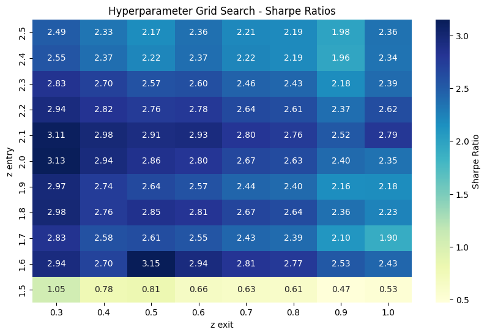

It's still a very good strategy - but all results take a slight hit on average. 

Another proven method to find the weight parameter is to find $$b$$ such that the series of the pair has the lowest Hurst exponent - implying that the series is as anti-persistent as possible. I haven't implemented that. 

## Multiple Criteria Decision Making 

From Šarić (2023), for a US securities application.

So far, we've been forcing that all assets are unique in our list of pairs. Inevitably, this means that some pairs which we find to be great candidates, have to be left out - because one of the assets in the pair is part of a previously chosen pair. We do this with a view to limit exposure to any one asset, but it's a sacrifice. We could miss a massive opportunity.
Another problem with not enforcing unique assets is with contradidictory signals. Let's say we have two pairs: (A, B), (A, C). The first is far past the threshold for buying the pair. In the second, it is only just past the threshold, but for selling, so we have less conviction that it will be profitable. Unfortunately, the signals will essentially cancel out, and we miss a worthwhile opportunity. 

The answer to this is multiple criteria decision making (MCDM). As the name suggests, we enter trades based on all the information, rather than just in one specific pair. This lets us reconcile contradictory signals, or go heavier into a trade we have more conviction in. We'll implement the potential method, a simple MCDM technique. 

At each time point $$t$$, we want to create a ranking of assets by some utility score, where we go long on the assets with the highest scores and short on the lowest scoring. To do this, we first need a preference function $$\rho(A, B)$$, which looks similiar to things we've seen before:

$$\rho(A, B) = \frac{(P_{A_t} - P_{B_t}) - \mu_{A, B}}{\sigma_{A, B}},$$

where $$P_{X_t}$$ again is the log price of the asset at time $$t$$, and $$\mu_{A, B}, \sigma_{A, B}$$ are the rolling mean and standard deviation of the log spread $$P_{A_t} - P_{B_t}$$ respectively, over a 30 day window. Like the series of the pair before, from this we can determine how many standard deviations the log spread is away from it's expected value. Once we have this, we want to break it down into how much of that spread is contributed by each asset. 

Let:

$$\rho(A, B) \approx u^*(A) - u^*(B),$$

$$\text{and}$$

$$\rho^*(A, B) = u^*(A) - u^*(B).$$

It won't always be possible to find a $$u^*$$ score that's correct for all sets of pairs, so we will have to settle for the best possible approximation - for that, we introduce the $$\rho^*(\cdot)$$ approximation of the original $$\rho$$ preference function. We can find our utility function by solving

$$\underset{u^*}{\arg\min}\left|\sum_{i, j} \rho\left(s_i, s_j\right) - \left[u^*\left(s_i\right)-u^*\left(s_j\right)\right]\right|,$$

for all assets $$i, j$$, therefore minimising the sum of differences between all $$\rho$$ and $$\rho^*$$.

We have an analytical solution for that optimisation problem, which maintains the direction of all preferences:

$$u^* = \frac{1}{N}B^T\rho$$

where
- $$u^*$$ is a vector of $$u^*(\cdot)$$ scores, one for each asset.
- $$N$$ is the number of unique assets, $$n$$ the number of pairs.
- $$B$$ is an incidence matrix, with a row for each pair, and column for each asset. Each row has a $$+1$$ in the column of the first asset, and a $$-1$$ in the column of the second. 
- $$\rho$$ is a vector with the preference score of each asset. 

Now that we have the utility scores, we want to isolate only the most over and undervalued assets. We remove any asset with a corresponding $$\mid u^* \mid < \kappa$$ for some thresholding parameter $$\kappa$$, then we take the remaining highest and lowest utility scoring assets as our longs and shorts. We also want to have our most exposure to the assets with the absolute highest / lowest scores - i.e., the more over / undervalued an asset, the more exposure.

For longs, the weight $$\omega$$ is determined as:

$$\omega(s_i) = \frac{|u^*(s_i)|}{\sum_{s_j \in T_L}|u^*(s_j)|}$$

with $$T_L$$ the set of all long positions, and $$\omega(s_i)$$ our weight to asset $$s_i$$. Apply the same weighting for shorts as well, but with $$T_S$$ the set of all short positions. 

With this system, we get (in theory) a significant improvement over previous implementations. 

However in practice, the cost in exchange fees of reweighting the portfolio at each time point adds up. The solution proposed by Šarić is the introduction of a momentum decorator - a position should be held active, whether that's long or short, until its utility sign reverses or it becomes 0, or more profitable positions are detected. 

#### MCDM Results

This time around we can use lots more pairs from the cointegration formation table (cointegration pairs over the Hurst pairs as they performed better at the previous stage). Implementing this gives us very weak results, at first glance.

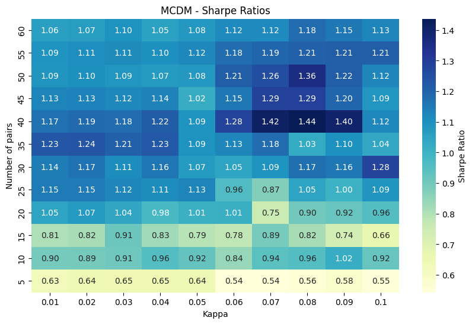

Unless we got very lucky and chose the exact perfect parameters, we'd have quite a low Sharpe. The best performing pair of number of pairs and our $$\kappa$$ threshold has a pnl curve looking like this:

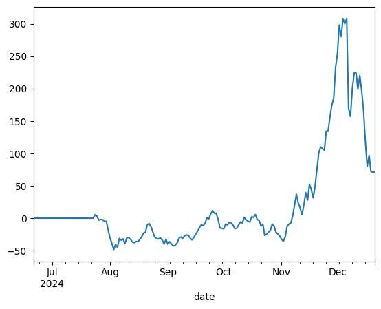

Clearly, a very chaotic strategy. The first few trades send it down 50%, before some incredible choices send it up to 300% returns, before it loses almost all of those gains and finishes around 60% up - obviously 60% up is incredible, but for that level of variability and drawdown? No thanks. *Again, note the big gains made in the back third.* 

#### Improving on the utility function

When we compute the utility scores by $$u^* = \frac{1}{N}B^T\rho$$, we lose some information. While all preference directions remain (if A was a better long candidate than B by preference function sign, it will show this as well in utility score), some information on the magnitude of that preference is lost. We can improve this by instead calculating the $$u^*$$ score with an OLS linear regression. 

So we modify our $$u^*$$ definition slightly, to

$$\underset{u^*}{\arg\min}\sum_{i, j}\left(\rho\left(s_i, s_j\right) - \left[u^*\left(s_i\right)-u^*\left(s_j\right)\right]\right)^2.$$

By using OLS we're penalising the squared error instead, so large deviations (when our $$u^*$$ is a reallyyy bad approximation) get penalised a lot more than small deviations. This has quite a meaningful impact on the performance of the strategy:

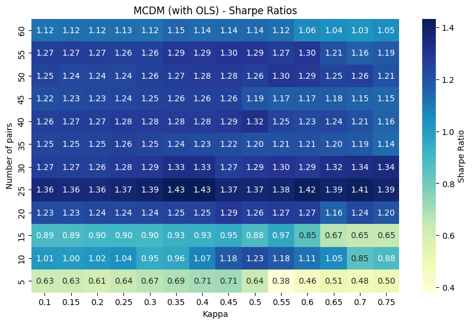

The Sharpe's are a lot more standard over the whole paramater search space now, so I'd be much more comfortable running this version of the strategy. The other takeaway we can have from this heatmap is it's clear how the strategy gets better with the number of pairs included - the more pairs included, the more signal we let ourselves capture.

An interesting direction to take this in would be to investigate weighting the signals coming from each pair. If we've included 100 pairs, the top pair is going to be much closer tracking pair than the bottom pair - so our generated signal should reflect that. Intuitively if all the top 5 pairs say to buy asset A, but the bottom 5 said to sell it, such that the net was no trade, I think I'd still buy the asset. 

### What market conditions does pairs trading want?

We want higher levels of volatility. Volatility tends to expose market innefficiencies, which is what any sort of statistical arbitrage will capture as profit. However, we don't want extreme levels of volatility - we want it to be mean reverting. If the volatility gets too high, we'll get entries but not be able to find exit opportunities. This is what I'm attributing the big gains made through November / December to. As BTC hit the big 100, more money flowed in than it'd seen in a while, juicing up the vol. The whole MicroStrategy shtick as well, bringing even more attention, will have only contributed even more (side note - very much looking forward to seeing what happens to Saylor and the rest of the fund).

One of the benefits of a pairs strategy is its theoretical delta neutrality - it isn't effected by the market as a whole going up or down. Whether this is achieved in practice is another story, since especially in crypto there are external factors like news specific to one asset that aren't reflected in others. And coins just completely crash as well, which we'd rather not happen (even if there's a chance we'd be short on it at the time of crash, it's a risk most would hope to avoid).

### Why does this work for equities? What about crypto? 

In an equities market, you'd see the sort of mean reverting relationship we're after commonly amongst pairs of equities in the same industry. For example, if a tax on cars is changing, that'd effect the whole industry around car manufacturing, so you'd expect changes in their prices to be similiar. Likewise, if one company manages to become more competetive through copyable processes, you'd expect other companies to follow their lead, hence correcting any difference in their prices. 

But why this works in crypto is a bit more foggy. Coins tend to lack those sort of tangible fundandamentals behind them. It's true to an extent, e.g. with L1 coins like Ethereum or Solana, but that sort of real dynamic is few and far between. However, crypto has more proportion of retail traders as opposed to traditional finance. There's a lot more 'dumb money'. I expect it's because of that money that the strategies here actually work so well. 

## Finishing up

Will I run one of these myself? Maybe. If I had a month of happy forward testing, I think I'd go for it. I haven't incorporated slippage calculations, and some of these assets aren't very liquid. Some see under a million USD in volume over a 24 hour period, so how much that'd effect the strategy is an unknown for now. Furthermore, while I discussed my hyperparameter cheating earlier, it's worth reiterating. What I've done is textbook overfitting. For forward testing, I would indeed use the best parameters found so far, but I would expect different pairs to be the best. The reason I haven't just used more data is just that it doesn't exist. All data is off of HyperLiquid, a newer exchange that isn't yet banned in the UK, but its data doesn't go far back enough. After excluding coins that had been added after just 18 months ago, I was left with just 71 assets, a very small universe for pair consideration. 

What I've learnt from this is that backtesting is surprisingly hard. I suspect that there'll be issues in the code I've written, or in my understanding of the research papers. Either way, I've learnt more about numpy, a technology which I continue to find difficult. 

And lastly, it's been satisfying to actually use some of the maths that I've learnt at university. I should've spent more time more on my Time Series Analysis unit though, wow. 

***

Jan 4th, 2025.